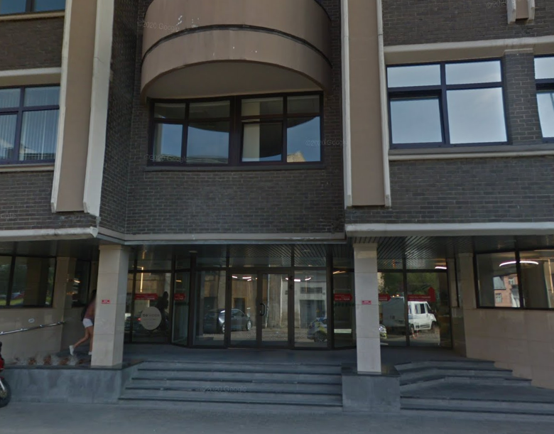

# Prezentācija par prakse

###### Maksims Cvetkovs DP3-3
###### **SIA "Media Partners"**

---

# Par prakses vietu

* Plaša biroja telpa sešstāvu ēkā.
* Uzņēmuma darbības joma - hostings, frontend un backend projektu izstrāde.
* Darba vietas organizācija - darbs pie sava klēpjdatora.
* Darba komanda - divi administratori, viens komandas vadītājs, pārējie izstrādātāji.

---

# Pienākumi prakses vietā

* Interfeisu un to funkcionalitātes izstrāde atbilstoši prasībām.
* Kļūdu labošana.
* Koda paātrināšana vietās, kur notiek lēna ielāde.

---

# Par darba dienu

* Darba laiks - no 12:00 līdz 19:00 darba dienās.
* Dažreiz reizi nedēļā tiek apspriesti daži jautājumi par projektu.
* Uzdevumu izpilde un to demonstrēšana dienas beigās.

---

# Par darba apjomu

Darbs tika veikts ar trim dažādiem projektiem.
Apmēram katru nedēļu ir jāveic 2-4 uzdevumi, kas saistīti ar datu bāzēm, tīmekļa lapām utt.

---

# Iegūtas atziņas, zināšanas, prasmes

* komandas darbā - problēmas pārrunāšana, ideju radīšana,
* Github izmantošanā komandā — veidojot Pull Request pieprasījumumus, repozitorija atzaru izveide,
* darbā ar attālinātajiem serveriem.

---

# Izmantotie avotie prakses laikā

1. Laravel dokumentācija. [saite](https://laravel.com/docs/9.x).
2. PHP dokumentācija. [saite](https://www.php.net/docs.php).
3. Vue js dokumentācija. [saite](https://vuejs.org/guide/introduction.html).
4. Buefy dokumentācija. [saite](https://buefy.org/documentation).

---

# Paldies par uzmanību! <!--fit-->